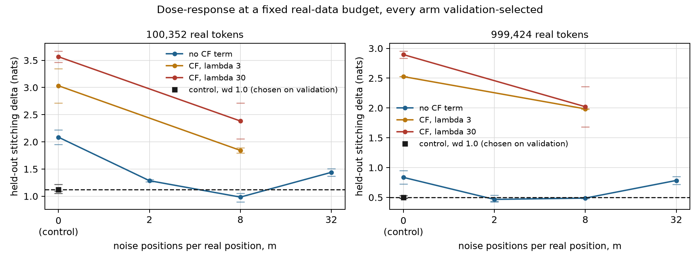

# 08: The data-limited protocol

**Status: pre-registered 21 Sep 2026.** Andres settled the four open decisions the same
day (last section). The commit that adds this sentence is the timestamp; step 1's
constants are asserted at launch by `experiments/pod/phase2b_step1.sh`, so a config that
drifts from this page stops the run instead of changing the experiment. No cell of this
protocol had been run when this was committed. Two probes were run first, both on Phase 2
artifacts and neither training anything, and both are reported below because they shaped
the design: `cf_probe.py` and a read of the harvested CF sketch.

## Why this exists

G2 judged the method at equal total FLOPs and it lost. That was the source document's own
kill line (§ "Kill: healed stagewise ≤ random-init + equal heal budget at equal total
FLOPs"), implemented literally. Andres's position, stated on 21 Sep after reading the
result, is that FLOPs was never the point:

> The intention of these regularizations is to reduce the need for more samples, to be
> more effective with less data, because for finetuning the main problem is not compute
> but data, and then to a lesser extent compute. If these random samples are required at
> 2x or 8x of regular data I want to know about it, but I would still consider it a
> success if I can produce a better model using these regularizations and random noise
> than without it for the same amount of data.

That is consistent with the rest of the source document ("noise is counted separately from
real tokens in every claim", mandatory control (1) "random-init + identical heal budget",
G3's "≤10^7 real tokens"). It is not consistent with the kill line, and the kill line is
what got measured.

**What this document does not do.** It does not edit G2. G2 fired under the criterion it
was registered with and `docs/06` stands as written. The criterion is being changed after
G2's result was known, which is exactly the move `CLAUDE.md` rule 3 warns about, so the
change is made in the open: a new question, a new protocol, its own margin, declared
before any run. If the new protocol also fails, the project has two negatives and not one
softened one.

## The criterion

1. **The budget is distinct real tokens, D.** Everything real that any arm touches comes
   from the same D-token subset of the declared slice: interface statistics (the whitening
   contract and the noise moments), anchors, the top-k store for the heal, on-policy rows,
   and the validation split used for early stopping and model selection. The source
   document's "real tokens do triple duty" becomes a rule rather than a convenience.
2. **Teacher queries are not data.** Noise positions cost compute only. They are counted
   and reported, never matched.
3. **Compute is reported, not matched, under a common generous cap.** Every arm may spend
   up to the FLOPs of the most expensive method configuration at that D. The baselines get
   the same cap and will stop earlier by validation patience; what they actually used is
   recorded. This is the exact converse of G2: there, the method was charged for its
   compute; here, no baseline can be called compute-starved.
4. **Selection never touches the held-out set.** Early stopping, learning-rate choice and
   checkpoint selection use a validation split carved from D (the last 10% of its rows,
   at least 4), identically for every arm. The 2M-token Pile-test held-out set is read
   once per finished model.
5. **Metric**: held-out next-token loss in nats, as before.

"Identical heal budget, one epoch each" is not the criterion, although the source document
reads that way and the method passes it at every budget (see below). A practitioner short
of data and not of compute runs the baseline for more epochs, and we measured what that
is worth: the random-init arm goes from 5.2693 to 3.5520 on the *same* 1e7 tokens by
recycling them 17.5 times. A data-limited comparison has to let every arm do that.

## What the existing cells already say under this criterion

Numbers from `experiments/paper/claims.py` (`scarce.*`, `long.*`, `heal.*`, `crossover.*`).

**Single stage, scarce anchors (Phase 1, stage 2, Q = 1e8).** Stitching delta, nats:

| real positions | anchors only (R) | anchors + noise (C_mix) | noise worth |
|---|---|---|---|
| 94k | 2.188 / 1.801 | 1.415 / 1.243 | +0.773 / +0.557 |
| 188k | 1.118 | 0.976 | +0.142 |
| 377k | 0.667 | 0.711 | -0.045 |
| 1.05M | 0.450 | 0.527 | -0.078 |
| 1.05M, Q = 3e8 | 0.782 / 0.638 | 0.413 / 0.401 | +0.369 / +0.237 |

This is the hypothesis in miniature: noise helps exactly where real data is scarce or
training is long, and the sign flips near 250k positions.

**It is also not yet evidence, because the baseline was never early-stopped.** At 94k
positions the anchors-only arm reaches its best eps, 0.632, at step 600 of 6104 on both
seeds, a tenth of the way in, and then climbs to 1.061 (1.052 on the second seed). Its
stitching delta was read at the final step. The noise arm peaks at 59% to 66% of the run
and barely moves afterwards (0.593 best, 0.600 final). So "+0.773" compares noise against
a model trained ten times past the point where anyone with a validation split would have
stopped it, and part of what noise is doing in that table is standing in for early
stopping. On eps at each arm's best checkpoint the gap is 0.040, not 0.46. What it is on
stitching delta at the best checkpoint was not recorded. **This is a handicap in the
method's favour of the same species as the ones in `docs/06`, and the new protocol exists
partly to remove it.**

**Composed and healed, D = 1e7.**

| arm | heal | held-out loss |
|---|---|---|
| plain KD from random init (B0) | 1 epoch | 5.2693 |
| plain KD from random init (B0) | 17.5 epochs | 3.5520 (n=2) |
| stagewise, real activations (B1) | 1 epoch | 3.4931 (n=3) |
| stagewise, noise recipe (M) | 1 epoch | 3.7283 (n=2) |

Three readings, none of them settled:

- At an identical one-epoch heal budget the method beats random init at every budget from
  1e5 to 1e7 tokens, by 0.93 to 1.55 nats. That passes the source document's control (1)
  as literally written, and it is the wrong comparison for the reason given above.
- The stagewise pipeline on real activations, with **one** heal epoch, already beats plain
  KD with 17.5 epochs on the same data (3.4931 against 3.5520). Under a data criterion the
  *decomposition* is plausibly a win at D = 1e7. M and B1 were never given a multi-epoch
  heal, so their best on this data is unknown.
- *Noise* does not help at D = 1e7: anchors-only beats the noise recipe by 0.235 after
  healing, which agrees with the single-stage crossover. The hypothesis worth testing is
  that noise's contribution turns positive as D falls below the crossover **and survives
  composition and a D-limited heal**. The "10x collapse under healing" in `docs/06` was
  measured with a heal that had ten times more real data than the anchors did; with the
  heal confined to the same small D, that collapse is not guaranteed.

One fact about scale, since the question mentions 2x and 8x: every noise cell run so far
used about 96 noise positions per distinct real position at the full anchor budget and
about 1000 at the scarce one. Nothing is known yet about small multipliers.

## Design

**Noise is a dose.** The treatment is the noise ratio m, noise positions per real position
in the training stream, and m = 0 is the control. Everything else is identical across
doses: same D, same contract, same selection rule, same cap. That isolates noise from the
stagewise pipeline, which the old C-versus-R comparison did only at m = 10. `DoseMix`
carries the fractional real count from batch to batch, so the ratio is exact over a cycle
and m = 32 is expressible at a batch of 8.

**The CF term is the second treatment** (decision 2). It is the source document's "soft
shape" penalty: 64 fixed unit directions, frequencies {0.5, 1, 1.5, 2}, squared difference
of the two empirical characteristic functions. Two things about it were settled by
measurement before this page was committed.

- *It is a two-sample statistic in whitened coordinates*, student output against teacher
  output on the same batch, so its optimum is the mimic optimum on real and on noise inputs
  alike, which is the condition the source document puts on any regularizer used as a
  loss. It is **not** the sketch the harvest accumulates. That one is in raw coordinates,
  and read back it is unusable as a uniform target: at interface 0 every |cf| is 1.000,
  at interface 6 it is 0.06 by t = 1, and only mid-depth interfaces happen to have unit
  scale.
- *There is something for it to act on.* `experiments/phase2b/cf_probe.py`, on the Phase 2
  stage-2 students and real held-out activations: the variance of the student's output
  along random whitened directions is **0.65** of the teacher's for the anchors-only
  student and **0.51** for the noise recipe. That is the conditional-mean shrinkage an MSE
  objective produces, and it means the next stage reads activations with half the spread
  it was trained on. The CF distance there is 0.017 to 0.037 against a relative MSE of 0.43
  to 0.48, so lambda = 3 puts the term at about a tenth of the MSE and lambda = 30 at about
  parity. Those two values are the grid.

The CF term cannot add information. It can only trade a little MSE for a correct marginal,
and whether the next stage prefers that is the empirical question.

| arm | what it is | answers |
|---|---|---|
| B0 | plain KD from random init on D, multi-epoch, validation-selected, lr grid | is the pipeline worth having at all |
| control | stagewise, m = 0, lambda = 0, weight decay in {0.1, 1.0} | the literal "without it", not left as a strawman |
| M(m) | stagewise, m in {2, 8, 32} | the claim, and how much noise it takes |
| CF | lambda in {3, 30}, at m = 0 and at m = 8 | regularization alone, and with noise |
| M+ | the chosen treatment with on-policy retraining (step 3) | does DAgger survive a D-limited heal |
| ref | KD on D plus teacher-generated text (step 3, reference, not a gate) | the other way to turn teacher compute into data |

**Selection, the same for every arm** (amended 21 Sep 2026, 18:05 UTC, see the amendment
at the end of this page). A cosine sized in advance cannot be used: a checkpoint lifted
from the middle of a long cosine run is at near-peak learning rate, and the arm that peaks
early (the control, at scarce data) would be read at its worst. So the length is chosen
and then annealed to. Warm up 100 steps to 3e-4, hold the rate, validate every 100 steps,
stop once 10 validations pass without a new best or at the cap of 6104 steps (1e8
positions, the source document's per-stage budget). "Best" is read on the three-point
centred mean of the validation curve, not on single validations. The model is the one
obtained by rewinding to the checkpoint a cooldown before the chosen step (a tenth of its
length, on the validation grid, at least 100 steps) and annealing the rate linearly to
zero so that the run **ends at the chosen length**. The annealed model is always the one
taken. Stages validate on **stitching delta** over the budget's validation rows (at most
32 of them), not eps: Phase 1 showed eps improve while stitching degrades. Heals validate
on next-token loss over the same rows.

**Choosing among configurations is also selection.** There are seven treatment
configurations against two controls. The best of each side is chosen on validation, and
only then is its held-out number read; choosing on the held-out score would hand the
treatment the best of seven draws.

**Budgets.** D = 49 and 488 rows of the declared slice (100,352 and 999,424 tokens), as
nested prefixes, sha256 per subset in the harvest record; 146 rows (299,008 tokens) only
if the sign changes between them. The last 10% of rows (at least 4) are validation and
everything else, statistics included, comes from the rest. At 49 rows that is 90,112
training positions for a 2048-dimensional covariance, which is what the shrinkage
estimator is for, and whatever that costs the noise arm is part of the method's price. The
already-measured D = 1e7 is the data-rich end.

**Three steps, each gated, cheapest first.**

*Step 1: single-stage dose-response with a fair baseline*, stage 2 (blocks 8 to 11, the
Phase 1 substrate). Nine configurations x two budgets x two seeds = 36 cells, then a third
seed on the chosen control and the chosen treatment at each budget. Three cells share one
A100. About 10 hours, **~$16**.

Gate S1, per budget: the chosen treatment's held-out stitching delta is below the chosen
control's by more than twice the pooled seed standard deviation, and no treatment seed is
above any control seed. If it passes at no budget, the Phase 1 effect was early stopping in
disguise; write that up and stop.

*Step 2: composed, the decisive test*, at each budget that passed S1. Six-stage stacks for
the control and the chosen treatment, every stage selected as above; compose; heal on D
with the same selection rule and an lr grid {3e-5, 1e-4, 3e-4}; B0 on the same D, same
grid, same rule; 3 heal seeds per arm; every arm of one budget on one machine, because the
replication pass put machine-to-machine error at 0.0135 against 0.0028 seed-to-seed. About
**$10 per budget**. (Clarified 21 Sep, before any step 2 run: each arm's learning rate is
chosen on the validation loss of heal seed 0, the only seed run at every rate, and seeds 1
and 2 run at the chosen rate. The stacks themselves are one seed each.)

*Step 3: the ends and the references.* Validation-selected multi-epoch heals for M and the
real-activation stack at D = 1e7 on the existing checkpoints (~$6); on-policy retraining
and the self-generated-text reference at the winning budget (~$8).

About **$50** if every step runs; the first gate can stop it at $16.

**Success (S2).** At some budget the chosen treatment beats **both** B0 and the control on
held-out next-token loss by at least 0.10 nats, means over 3 seeds, no overlap between the
arms' ranges, same machine. 0.10 is five times the measured run-to-run noise of 0.02.

**Kill.** The treatment loses to the control at every budget: neither noise nor the CF
term buys anything at the model level even when data is the binding constraint. It beats
the control but loses to B0 at every budget: they help a pipeline that is itself not worth
running.

**Reported whatever happens**, generated not typed: per arm and budget, the noise
positions per distinct real token, the number of passes over the real data, total FLOPs and
their multiple of what the control spent, the step validation chose, whether the run
stopped on patience or hit the cap, the student's output dispersion relative to the
teacher's, and the held-out number. That table is the answer to "2x or 8x".

## The code, all of it tested on CPU before any rental

- `lwd.harvest.budget` and `budget_rows` in the harvest: statistics, anchors and the top-k
  store from the training rows of the budget, validation activations written after the
  statistics are closed. Tested end to end on pythia-70m.
- `lwd.noise.samplers.DoseMix`: exact ratio, m = 0 without a noise sampler, m above the
  batch size.
- `lwd.stage.cf.CFDistance`: zero at the mimic optimum, monotone in under-dispersion, its
  gradient pushes a shrunk student back out, blind to a permutation of positions (which is
  why it is only ever added to the MSE).
- `lwd.stage.select` and `lwd.heal.select`: hold, validate, stop on patience, cool the
  best checkpoint, keep the better; the restored weights are exactly the validated ones.
- `experiments/phase2b/cell.py`: one cell, accounts for every position, refuses to
  overwrite a result, asserts the statistics came from the training rows alone.
- `experiments/phase2b/gate.py`: gate S1, configurations chosen on validation.
- `experiments/pod/phase2b_step1.sh`: resumable queue, schedule asserted at launch, logs
  rotated. The guards from `docs/07` carry over unchanged.

The chain was run end to end twice before this page was committed, neither run being a
cell of the protocol: on pythia-70m (harvest, a control cell, a dosed CF cell, the gate),
and for 35 steps on the real 1.4B on the laptop to exercise fp16 stitching and the
contract at d = 2048 from a 90k-token budget.

## What happens to the paper

Hold it. Its measurements stand, including "at equal FLOPs the noise recipe loses by 0.176
nats". Its framing as a negative result about the method is a statement about a
compute-limited objective the author does not hold. If S2 passes, the paper becomes "loses
at equal compute, wins at equal data below X tokens, and interface metrics overstate
either way", which is a better paper. If S2 fails, the negative is complete instead of
partial. Either way it should not go out before step 2.

## Decisions, settled by Andres on 21 Sep 2026

1. **"Without it" means both.** Success requires beating the same pipeline without the
   treatment and plain KD on the same data.
2. **The CF-regularized arm is in.** Defined above; screened in step 1 alongside the noise
   doses and carried into step 2 if validation chooses it.
3. **Margin 0.10 nats; budget about $50.**
4. **No pretrained start.** Every arm starts from random weights. "Finetuning" in the
   original statement was loose wording for a data-limited setting, not a requirement.

## Amendment 1: the selection rule, 21 Sep 2026 18:05 UTC

Made 45 minutes into step 1, after one cell had finished and before any comparison between
arms had been read. The original rule is in the history of this file at `7f7643c`: cool
down *from the best checkpoint* and keep whichever of the two validated better.

**What was seen.** The first cell to finish was a treatment arm, m = 8 at 49 rows
(`out/phase2b/cells-pod-rule-v1/`). Its validation stitching delta every 100 steps read

    1800: 1.22   2000: 1.23   2200: 1.28   2400: 1.76   2500: 1.20   2600: 2.36   3300: 2.53

so the "best", 1.20 at step 2500, was a single dip between 1.76 and 2.36 on a curve that
had plateaued near 1.25 by step 1800 and was by then overfitting its 44 real sequences (76
passes over them; train loss still falling). The cooldown started there, trained further
into the overfit regime, and validated at **2.21**. The rule fell back to the un-annealed
snapshot.

**Why that is not a detail.** Under the original rule an arm that peaks early can never be
annealed, because a cooldown that starts at its peak only overfits it further, while an arm
that runs to the cap always is. The arm that peaks earliest is the control. That is a
handicap in the treatment's favour of the same species as the ones `docs/06` lists, found
this time before it could decide anything. The dip is a second, symmetric fault: choosing
single validations that move by a nat between neighbours selects noise.

**The amended rule** is the paragraph above: smoothed curve, rewound cooldown that ends at
the chosen length, always the annealed model. It is what a schedule sized for each arm's
own best length would have produced. It helps early-peaking arms most, so if it moves the
result it moves it toward the control.

**What it cost.** The queue was stopped and restarted from zero at 18:07 UTC: 45 minutes
of pod time and six idle minutes, about $1.35. The three treatment cells that had finished
under the old rule are kept in `cells-pod-rule-v1/` as a record of that rule and are not
results of this protocol. No control cell had finished, so no comparison exists under the
old rule to be tempted by.

**The heal follows the same rule with a coarser grid**, settled before any heal ran: it
validates every 200 steps with a patience of 5 where a stage uses 100 and 10. That is the
same 1000 steps of patience. The reason is memory and nothing else: a rewind needs the
window of snapshots back to where the cooldown starts, a heal's snapshot is 600M weights
plus their Adam moments (kept in bfloat16, 4.8 GB), and three heals share one host. Both
trainers run one implementation of the rule, `lwd.stage.select.select_length`.

**What this amendment is not.** It is a change made after seeing data, and it should be
read with that in mind. What it was shown was one arm's training curve, not an outcome.

---

## Step 1 result: gate S1 fails at both budgets (22 Sep 2026)

40 cells on pod `vm499pfn1f5b8w` (`docs/09`), stage 2 of Pythia-1.4B, every arm trained to
its validation-selected length under Amendment 1's rule, configurations chosen on
validation and read on held-out. Records in `out/phase2b/cells-pod/`; every number below is
in `experiments/paper/claims.py` under `s1.*` and the tables are generated by
`experiments/phase2b/report.py`.

**Budget 49 rows (100,352 real tokens).** Held-out stitching delta, nats.

| m | lambda | wd | seeds | held-out | range | chosen step | stopped | noise pos / real token | passes over D | FLOPs x chosen control (wd 1) | dispersion |
|---|---|---|---|---|---|---|---|---|---|---|---|
| 0 | 0 | 0.1 | 2 | 2.086 | 1.951 to 2.221 | 400 | patience | 0 | 291 | 0.4 | 0.62 |
| 0 | 0 | 1 | 3 | 1.121 | 1.050 to 1.217 | 2867 | patience | 0 | 776 | 1.0 | 0.84 |
| 0 | 3 | 0.1 | 2 | 3.032 | 2.715 to 3.349 | 800 | patience | 0 | 364 | 0.5 | 0.79 |
| 0 | 30 | 0.1 | 2 | 3.566 | 3.460 to 3.671 | 3950 | patience | 0 | 991 | 1.3 | 0.83 |
| 2 | 0 | 0.1 | 2 | 1.286 | 1.266 to 1.306 | 2000 | patience | 400 | 200 | 0.8 | 0.52 |
| 8 | 0 | 0.1 | 3 | 0.984 | 0.898 to 1.051 | 3000 | patience | 717 | 90 | 1.0 | 0.47 |
| 8 | 3 | 0.1 | 2 | 1.843 | 1.797 to 1.890 | 2150 | patience | 558 | 70 | 0.8 | 0.60 |
| 8 | 30 | 0.1 | 2 | 2.384 | 2.056 to 2.712 | 2500 | patience | 622 | 78 | 0.9 | 0.88 |
| 32 | 0 | 0.1 | 2 | 1.440 | 1.371 to 1.509 | 2350 | patience | 644 | 20 | 0.9 | 0.40 |

**Budget 488 rows (999,424 real tokens).** Held-out stitching delta, nats.

| m | lambda | wd | seeds | held-out | range | chosen step | stopped | noise pos / real token | passes over D | FLOPs x chosen control (wd 1) | dispersion |
|---|---|---|---|---|---|---|---|---|---|---|---|
| 0 | 0 | 0.1 | 2 | 0.836 | 0.722 to 0.949 | 1650 | patience | 0 | 53 | 0.8 | 0.59 |
| 0 | 0 | 1 | 3 | 0.502 | 0.486 to 0.533 | 2400 | patience | 0 | 68 | 1.0 | 0.62 |
| 0 | 3 | 0.1 | 2 | 2.526 | 2.525 to 2.527 | 550 | patience | 0 | 32 | 0.5 | 0.93 |
| 0 | 30 | 0.1 | 2 | 2.895 | 2.834 to 2.956 | 2050 | patience | 0 | 61 | 0.9 | 0.95 |
| 2 | 0 | 0.1 | 3 | 0.466 | 0.426 to 0.537 | 5268 | cap/patience | 75 | 37 | 1.6 | 0.59 |
| 8 | 0 | 0.1 | 2 | 0.488 | 0.482 to 0.494 | 6102 | cap | 109 | 14 | 1.8 | 0.52 |
| 8 | 3 | 0.1 | 2 | 1.984 | 1.978 to 1.991 | 1400 | patience | 43 | 5 | 0.7 | 0.68 |
| 8 | 30 | 0.1 | 2 | 2.021 | 1.683 to 2.360 | 4752 | cap/patience | 93 | 12 | 1.5 | 1.10 |
| 32 | 0 | 0.1 | 2 | 0.784 | 0.721 to 0.848 | 6002 | cap | 119 | 4 | 1.8 | 0.43 |

### The gate

| budget | control chosen on validation | treatment chosen on validation | gap | seeds overlap | S1 |
|---|---|---|---|---|---|
| 100,352 tokens | wd 1.0: **1.121** (1.050 / 1.095 / 1.217) | m = 8: **0.984** (0.898 / 1.004 / 1.051) | +0.137 | yes (1.051 vs 1.050) | fail |
| 999,424 tokens | wd 1.0: **0.502** (0.486 / 0.488 / 0.533) | m = 2: **0.466** (0.426 / 0.435 / 0.537) | +0.036 | yes | fail |

The gate needed a gap above twice the pooled seed SD and no overlap between the arms'
seeds. It fails on both counts at both budgets. The pooled-SD criterion had an ambiguity
(the implementation pooled every arm, and the noisy CF arms dominate that pool), which was
flagged before the third seed landed; it is moot, because the gap is inside twice the SD of
the two compared arms alone as well (0.137 against about 0.17 at the small budget), and
because the third seed overlapped the ranges on its own.

### What it says

**Weight decay does most of what noise was credited with.** Raising weight decay from 0.1
to 1.0 on the plain anchors-only arm is worth **0.96 nats** at 1e5 tokens and 0.33 at 1e6.
The best noise dose is worth a further 0.14 and 0.04 on top of that, inside the seed noise.
Phase 1's "+0.773 nats from noise at 94k anchors" was measured against a wd 0.1 control
read ten times past its best step; against a wd 1.0 control read at its best, the same
comparison gives +0.14 with overlapping seeds. Most of the Phase 1 effect was the baseline.

**There is a dose-response, and it moves with the data budget.** At 1e5 tokens m = 8 is
best (m = 2 gives 1.29, m = 32 gives 1.44); at 1e6 tokens m = 2 is best and m = 8 is
level with it, with m = 32 clearly worse at both. That is the shape the crossover
hypothesis predicted. It is also small. And at 1e6 tokens every noise arm ran to the
compute cap still improving, so that budget is compute-limited at the pre-registered cap;
the cap was pre-registered and is not raised here.

**The CF term hurts, everywhere.** At m = 8 it costs 0.86 nats at lambda = 3 (1e5 tokens)
and 1.50 (1e6), more at lambda = 30, on both seeds at both budgets. It does what it was
built to do at the marginal: output dispersion rises from 0.47 to 0.60 to 0.88 of the
teacher's. The next stage does not reward a correct marginal bought with a worse
conditional. Only lambda in {3, 30} was pre-registered; smaller weights are untested.

**Cost of the treatment.** Against the chosen control, m = 8 at 1e5 tokens used 1.04x the
FLOPs (the wd 1.0 control also trains long) and 717 noise positions per real token; m = 2
at 1e6 tokens used 1.65x and 75 per real token. The "2x or 8x" question has its answer for
this stage: the noise arm is not expensive, it is just not worth much.

### Per the pre-registration

"If it passes at no budget, the Phase 1 effect was early stopping in disguise; write that
up and stop." Step 2 does not run. Combined with G2, the record on this method is now:

- at equal total FLOPs, the noise-fed stagewise stack loses to plain KD by 0.176 nats;
- at equal real data, with every arm trained to its own best length, noise beats a
  well-regularized anchors-only stage by 0.14 nats at 1e5 tokens and 0.04 at 1e6, inside
  the seed noise both times, and the CF regularizer makes things worse.

What survives is narrower than either version of the hypothesis: noise is a regularizer
of about the same strength as turning weight decay up, and weight decay is free.

**What was not tested.** Composition and healing at a small budget (step 2), so nothing
here says how the 0.14 would compound or wash out in a full stack. The heal at D = 1e7
where the real-activation stack already beats plain KD (step 3) is also untouched; that
comparison is about the decomposition, not the noise, and is the one live positive result
in the project. Both are recorded as open, not as run.
